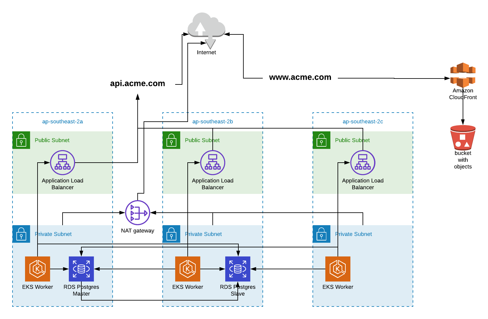

# ACME-DEMO

After given the requirements I broke everything down to seperate tasks. The setting up of the UI was the easy part but then setting up all the infrastructure of the API took a little bit longer.

#### UI
	Create s3 bucket
	Create cloudfront point to bucket 
	TODO: Create bash script to do releases which ties into CI (make life easier)
	TODO: Setup dns to point to acme.com ( I dont have a domain)

#### VPC
	Creates a public and private vpc
	Spreads it across 2 AZ as a minimum
	TODO: Setup acl to allow DNS HTTP/ HTTPS out publicly

#### EKS
	Create EKS cluster 
	TODO: Setup logging to go to cloudwatch 
	TODO: Setup prometheus collectors to forward data to it 

#### APP
	Create HELM file for API
	Use AWS loadblanacer
	Setup container env variables
	Setup prometheus 
	Document steps to deploy app 
	Helm chart to install ALB 
	TODO: Bashscript to deploy latest version

#### DB
	Take input from VPC to deploy RDS 
	Create SG and allow subnet from EKS to access it 
	Setup a snapshot timeframe
	TODO: Setup prometheus data collectors

#### Prometheus
	Initalise from helm chart

To make it easier I made a graph showing all infrastructure layout

## Pre-Requiset 
To get this all deployed you will need `Terraform v0.12`, `kubectl`, `awscli` and the `aws-iam-authenticator`. To install the `aws-iam-authenticator` you will need to have go installed localy and your $PATH pointing to you `go/bin` directory.

`go get -u -v sigs.k8s.io/aws-iam-authenticator/cmd/aws-iam-authenticator`

## Creating the infrastructure 

Once you have all the tools installed you will need to go to the root directory of this repo and from there run the command `terraform init`. Terraform will go then and get all the required modules to setup the required infrastructure.

Once you are ready you can run the following command 

`terraform plan -var-file=ENV/s3-dev.tfvars -var-file=ENV/dev.tfvars -var-file=ENV/rds-dev.tfvars -out dev.out`

What this does is run a plan of what terraform will build. It uses the variable files from the `ENV` directory. Once completed you will need to run the following command to start the building of the infrastructure.

`terraform apply "dev.out"`

This will setup a S3 bucket where the static website will be served from.From here it wil then start building the VPC with public subnets and private subnets across all three australian az. 
Once the VPC creation is completed it will start the creation of the postgres Master server and then the ASG for the EKS cluster. When the Postgres Master is completed it will then start building the Postgres Slave. Both of these services will be running  in the private subnet. Grab a coffe as this usually takes about 15 minutes to create from scratch.

Once the EKS cluster is setup it will generate the kubcetl config file which you can use to connect to the cluster.

## Connecting to EKS

To connect to the cluster run the following command 

`kubectl get namespaces --kubeconfig=kubeconfig_test-eks-YySjiu2M`

This will show you all the name spaces available.

NAME          STATUS   AGE
default       Active   134m
kube-public   Active   134m
kube-system   Active   134m

## Destorying the infrastructure 

`terraform destroy -var-file=ENV/rds-dev.tfvars -var-file=ENV/dev.tfvars -var-file=ENV/s3-dev.tfvars`

# HELM and deploying apps 

## Helm init 

## Installing prometheus using helm
`helm install stable/prometheus --name test-prometheus -f HELM/prometheus_values.yaml --kubeconfig={ClusterConfigFile}`

## Setting ALB intergration

`helm repo add incubator http://storage.googleapis.com/kubernetes-charts-incubator`

`helm install incubator/aws-alb-ingress-controller --set autoDiscoverAwsRegion=true --set autoDiscoverAwsVpcID=true --set clusterName=test-cluster`

